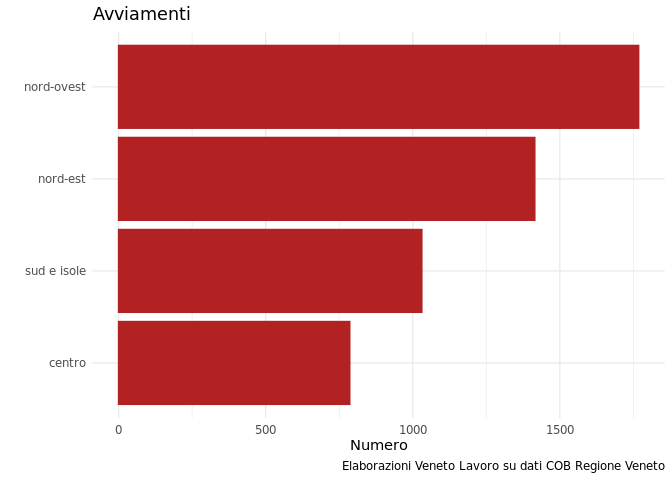

<!-- README.md is generated from README.Rmd. Please edit that file -->

# vlcompanion

<!-- badges: start -->
<!-- badges: end -->

Obiettivo di vlcompanion facilitare il calcolo di alcune statistiche
sulle COB e usare le funzioni per la creazione di dashboard.

## Installazione

Puoi installare al versione di sviluppo di vlcompanion da
[GitHub](https://github.com/) con:

``` r
# install.packages("devtools")
devtools::install_github("gmontaletti/vlcompanion")
```

## Esempi

La prima funzione `cosaldi()` calcola i saldi giornalieri fra avviamenti
e cessazioni e il saldo cumulato, usando una variabile come
raggruppamento.

Il risultato è una data table.

``` r
library(vlcompanion)
#> 
#> Attaching package: 'vlcompanion'
#> The following object is masked from 'package:graphics':
#> 
#>     coplot
cosaldi(eventi, inizio, fine, area) |> head()
#> Key: <data>
#>          data avviati cessati saldo saldo_cumulato        area
#>        <Date>   <int>   <int> <int>          <int>      <fctr>
#> 1: 2020-01-01       2       0     2              2      centro
#> 2: 2020-01-01       2       0     2              2    nord-est
#> 3: 2020-01-01       3       0     3              3  nord-ovest
#> 4: 2020-01-01       1       0     1              1 sud e isole
#> 5: 2020-01-02       1       0     1              3      centro
#> 6: 2020-01-02       6       0     6              8    nord-est
```

Dato un file di eventi con la struttura che segue:

``` r
head(eventi)
#>      cod     inizio genere settore        area durata_giorni       fine
#>    <int>     <Date> <fctr>  <fctr>      <fctr>         <int>     <Date>
#> 1:     1 2020-03-14      F servizi  nord-ovest           462 2021-06-19
#> 2:     2 2020-12-05      F servizi sud e isole            92 2021-03-07
#> 3:     3 2020-01-11      F servizi      centro           111 2020-05-01
#> 4:     4 2020-10-17      F servizi  nord-ovest           333 2021-09-15
#> 5:     5 2020-07-16      M servizi sud e isole          1037 2023-05-19
#> 6:     6 2020-03-01      M servizi sud e isole           392 2021-03-28
```

è possibile generare un grafico a barre direttamente con la funzione
\`cobarre()\`, passando come parametri il nome del data frame e una
variabile di raggruppamento.



In corso di revisione la funzione coplot
