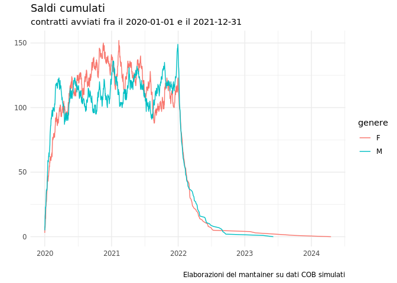

<!-- README.md is generated from README.Rmd. Please edit that file -->

# vlcompanion

<!-- badges: start -->
<!-- badges: end -->

Obiettivo di vlcompanion facilitare il calcolo di alcune statistiche
sulle COB e usare le funzioni per la creazione di dashboard.

## Installazione

Puoi installare al versione di sviluppo di vlcompanion da
[GitHub](https://github.com/) con:

``` r
# install.packages("devtools")
devtools::install_github("gmontaletti/vlcompanion")
```

### Uso

``` r
library(vlcompanion)
```

## Esempi

### La base dati eventi simulati

il package contiene un dataset di eventi simulati con un inizio, durata
in giorni, una fine e tre fattori (genere, settore e area geografica).

Il dataset non è una ricostruzione realistica, dato che tutti contratti
simulati iniziano in un periodo specifico e risultano tutti conclusi
entro tre anni. La struttura dele informazioni, generate casualmente,
riflette quella di un vero archivio di COB.

Il file di eventi presenta la struttura che segue:

``` r
data(eventi)
head(eventi)
#>   cod     inizio genere   settore       area durata_giorni       fine
#> 1   1 2020-08-16      M   servizi   nord-est            12 2020-08-28
#> 2   2 2021-09-04      M   servizi     centro             4 2021-09-08
#> 3   3 2021-05-11      M industria nord-ovest            27 2021-06-07
#> 4   4 2021-06-05      M   servizi nord-ovest            33 2021-07-08
#> 5   5 2021-05-02      F   servizi nord-ovest            39 2021-06-10
#> 6   6 2020-11-20      F   servizi   nord-est             8 2020-11-28
```

### La funzione \`cosaldi()\`

La prima funzione `cosaldi()` calcola i saldi giornalieri fra avviamenti
e cessazioni e il saldo cumulato, usando una variabile come
raggruppamento.

Il risultato è una data table.

``` r
library(vlcompanion)
cosaldi(eventi, inizio, fine, area) |> head()
#> Key: <data>
#>          data avviati cessati saldo saldo_cumulato        area
#>        <Date>   <int>   <int> <int>          <int>      <fctr>
#> 1: 2020-01-01       2       0     2              2      centro
#> 2: 2020-01-01       5       0     5              5    nord-est
#> 3: 2020-01-01       1       0     1              1 sud e isole
#> 4: 2020-01-02       2       0     2              7    nord-est
#> 5: 2020-01-02       5       0     5              5  nord-ovest
#> 6: 2020-01-02       1       0     1              2 sud e isole
```

### La funzione \`cobarre()\`

E’ possibile generare un grafico a barre direttamente con la funzione
\`cobarre()\`, passando come parametri il nome del data frame e una
variabile di raggruppamento.


### La funzione \`cobplot()\`

La funzione \`cobplot()\` restituisce la curva dei saldi cumulati per
una variabile di raggruppamento.

``` r
cosaldi(eventi, inizio, fine, genere) |>
         cobplot(gruppo = genere)
```


